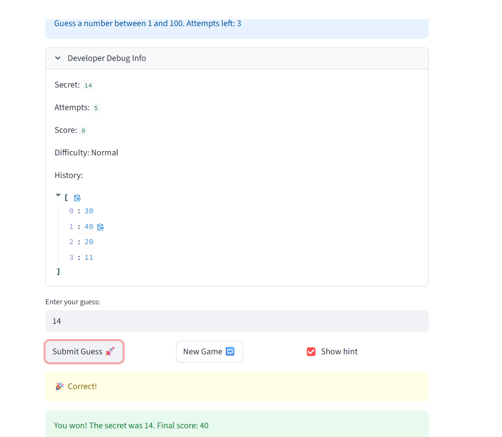

# 🎮 Game Glitch Investigator: The Impossible Guesser

## 🚨 The Situation

You asked an AI to build a simple "Number Guessing Game" using Streamlit.
It wrote the code, ran away, and now the game is unplayable. 

- You can't win.
- The hints lie to you.
- The secret number seems to have commitment issues.

## 🛠️ Setup

1. Install dependencies: `pip install -r requirements.txt`
2. Run the broken app: `python -m streamlit run app.py`

## 🕵️‍♂️ Your Mission

1. **Play the game.** Open the "Developer Debug Info" tab in the app to see the secret number. Try to win.
2. **Find the State Bug.** Why does the secret number change every time you click "Submit"? Ask ChatGPT: *"How do I keep a variable from resetting in Streamlit when I click a button?"*
3. **Fix the Logic.** The hints ("Higher/Lower") are wrong. Fix them.
4. **Refactor & Test.** - Move the logic into `logic_utils.py`.
   - Run `pytest` in your terminal.
   - Keep fixing until all tests pass!

## 📝 Document Your Experience

-Game's Purpose:
The "Glitchy Guesser" is a Streamlit-based number guessing game designed as a debugging challenge. The core objective is to find a secret number within a limited set of attempts based on the chosen difficulty level (Easy, Normal, or Hard).

Detail which bugs you found:

The Logical Inversion: The hints were swapped; the game told me to "Go HIGHER" when my guess was already above the secret number.

The Session State Bug: The secret number regenerated on every rerun (every button click), making it impossible to narrow down the target.

The Type Mismatch: On even-numbered attempts, the code forced the secret number into a string format, causing comparison errors and  Intermittent Glitches. 

Explain what fixes you applied:

Modular Refactoring: I moved all core logic (guessing, scoring, and range setting) into logic_utils.py to isolate the  brain from the UI.

State Persistence: I implemented st.session_state to ensure the secret number and score remain constant throughout the game session.

Type Normalization: I ensured all comparisons are done between integers and added a try-except block in the input parsing to handle non-numeric text gracefully.

## 📸 Demo 

## 🚀 Stretch Features 
